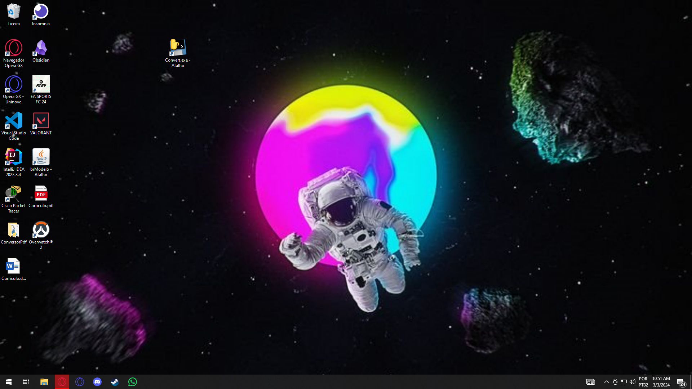

# Conversor DOCX para PDF

Este é um simples conversor de documentos DOCX para PDF desenvolvido em Python, utilizando a biblioteca tkinter para a interface gráfica, docx2pdf para a conversão de documentos e tqdm para exibir o progresso da conversão.

## Funcionalidades Principais
- Interface gráfica amigável para seleção de arquivos DOCX.
- Barra de progresso que indica o status da conversão.
- Facilidade de uso para converter rapidamente documentos DOCX em PDF.

<<<<<<< HEAD
## Como Usar
1 - Rodar o executavel

=======
>>>>>>> aff9f45b9a6188c0f869e4dd55851aa644b7e626
